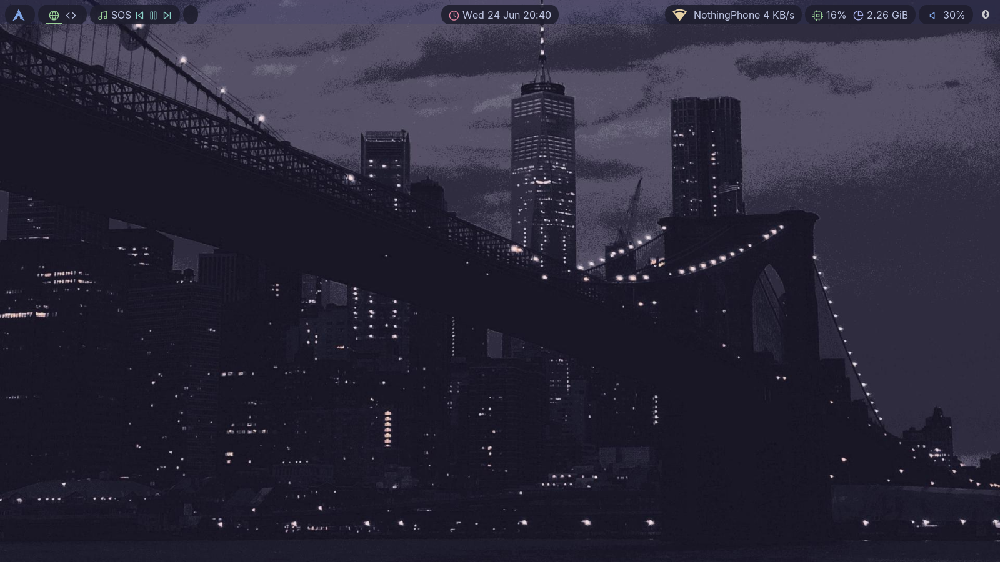
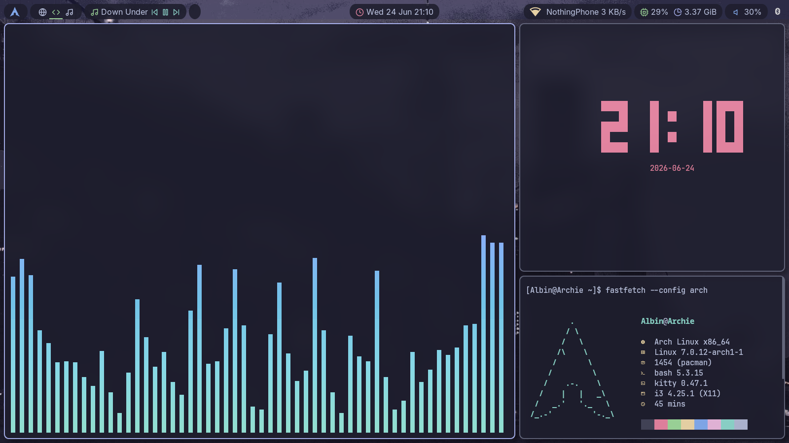
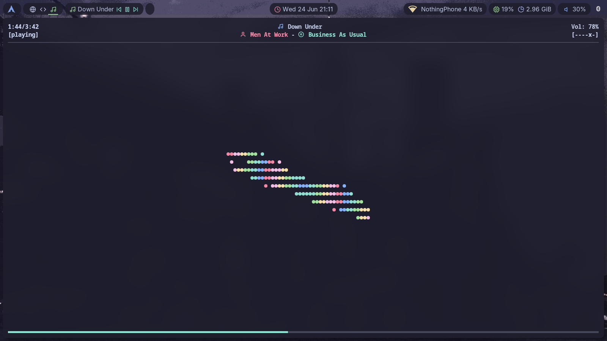

# Catppuccin Theme Dotfiles

A dotfiles collection for i3, Polybar, Rofi, Kitty, Alacritty, Dunst, btop, ncmpcpp, picom, qt5ct, and networkmanager-dmenu — all themed with Catppuccin's four variants: Latte, Frappé, Macchiato, Mocha.

> **Credit**: Built on [Keyitdev's dotfiles](https://github.com/Keyitdev/dotfiles).

## What this does

- Switch Catppuccin variants across your entire desktop in one command
- Install with a single script that handles dependencies, backs up your existing configs, and applies themes
- Apply themes at runtime without reinstalling
- System scripts for volume, brightness, screenshots, and power menu bound to i3 keys

## Install

```bash
./install.sh                    # full install, Mocha variant
./install.sh --dry-run          # preview changes
./install.sh --skip-deps        # skip dependency installation
./install.sh --variant=latte    # choose variant: latte, frappe, macchiato, mocha
```

## Switch themes anytime

```bash
./theme-switcher.sh mocha --preview       # see what Mocha looks like
./theme-switcher.sh frappe --apply-home   # recolor ~/.config in place
./theme-switcher.sh macchiato --render-to /tmp/staging  # generate themed configs to a directory
```

## Inspect colors

```bash
source theme-engine/catppuccin-palette.sh && get_variants
source theme-engine/catppuccin-palette.sh && get_color mocha blue
source theme-engine/catppuccin-palette.sh && print_colors mocha
```

## Key i3 bindings (Mod = Super/Windows key)

| Key | Action |
|-----|--------|
| Mod+Return | Open Kitty |
| Mod+D | App launcher (Rofi) |
| Mod+A | Run launcher (Rofi drun) |
| Mod+Shift+Q | Close window |
| Mod+1-0 | Switch workspace |
| Mod+Shift+1-0 | Move window to workspace |
| Mod+X | Power menu |
| Mod+C | Screenshot menu |
| Mod+Z | Music player (ncmpcpp) |

## Project structure

```
install.sh                    # main installer
theme-switcher.sh             # theme management
theme-engine/
  catppuccin-palette.sh       # color definitions + helpers
  templates/                  # Polybar, Rofi templates with {{placeholders}}
canonical-configs/            # reference configs for 11 apps
usr/                          # scripts → /usr/local/bin, fonts → /usr/share/fonts
screenshots/                  # desktop previews
```

## Screenshots

| Preview | Description |
|---------|-------------|
|  | i3 + Polybar + Rofi |
|  | Kitty + ncmpcpp |
|  | Apps overview |
